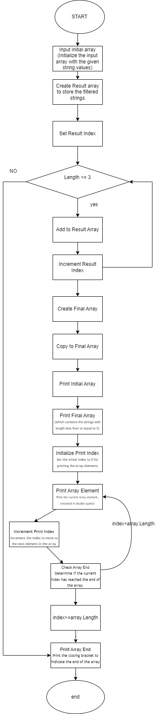

# Итоговая контрольная работа по основному блоку
## 
1. Создать репозиторий на GitHub
2. Нарисовать блок-схему алгоритма (можно обойтись блок-схемой основной содержательной части, если вы выделяете её в отдельный метод)
3. Снабдить репозиторий оформленным текстовым описанием решения (файл README.md)
4. Написать программу, решающую поставленную задачу
5. Использовать контроль версий в работе над этим небольшим проектом (не должно быть так, что всё залито одним коммитом, как минимум этапы 2, 3, и 4 должны быть расположены в разных коммитах)

### 
*Задача: Написать программу, которая из имеющегося массива строк формирует новый массив из строк, длина которых меньше, либо равна 3 символам. Первоначальный массив можно ввести с клавиатуры, либо задать на старте выполнения алгоритма. При решении не рекомендуется пользоваться коллекциями, лучше обойтись исключительно массивами.*


**Решение**

Исходный массив строк
```csharp
string[] inputArr = { "Hello", "2", "world", ":-)" };
```
Создаем новый массив для хранения результатов
```csharp
string[] resultArray = new string[inputArr.Length];
```
Индекс для добавления элементов в новый массив

```csharp
int resultIndex = 0;
```
 Проходимся по исходному массиву
 ```csharp
 foreach (string str in inputArray)
 ```
 Проверяем длину строки
 ```csharp
{
           
            if (str.Length <= 3)
            {
          
                resultArray[resultIndex] = str;
                resultIndex++;
            }
        }
 ```
  Создаем новый массив, который содержит только элементы с длиной <= 3 символам
```csharp
  string[] finalResult = new string[resultIndex];
```
Выводим результат на экран
```csharp
Console.WriteLine("initial array:");
        PrintArray(inputArr);

         Console.WriteLine("New array with strings, which length less than 3 symbols:");
        PrintArray(finalResult);
```
метод для печати массива строк
```csharp
static void PrintArray(string[] arr)
    {
        Console.Write("[");
        for (int i = 0; i < arr.Length; i++)
        {
            Console.Write($"\"{arr[i]}\"");
            if (i < arr.Length - 1)
            {
                Console.Write(", ");
            }
        }
        Console.WriteLine("]");
    }
```


**Блок-Схема**
